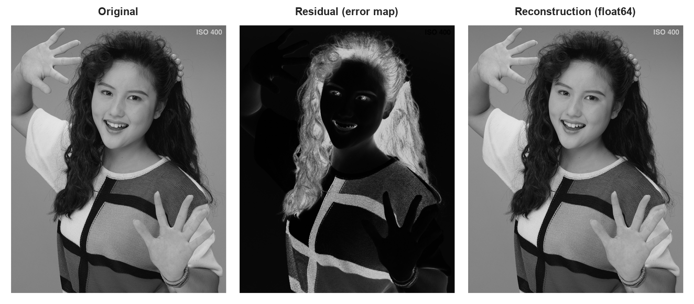
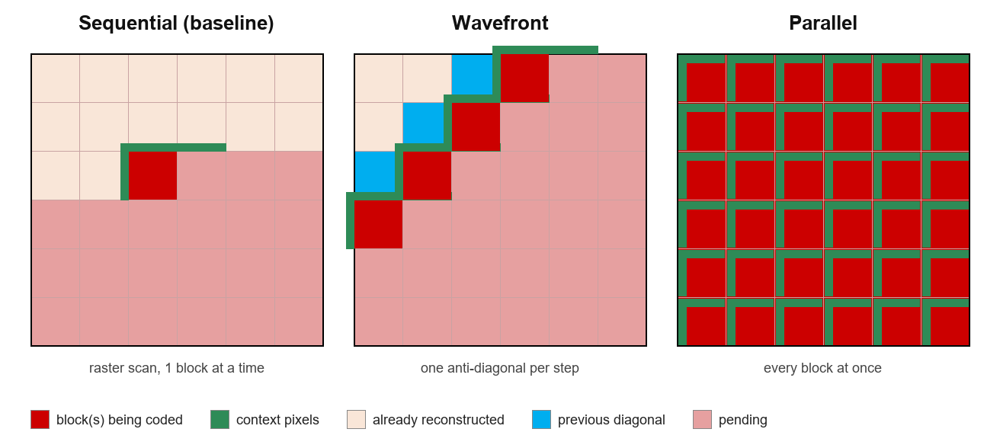
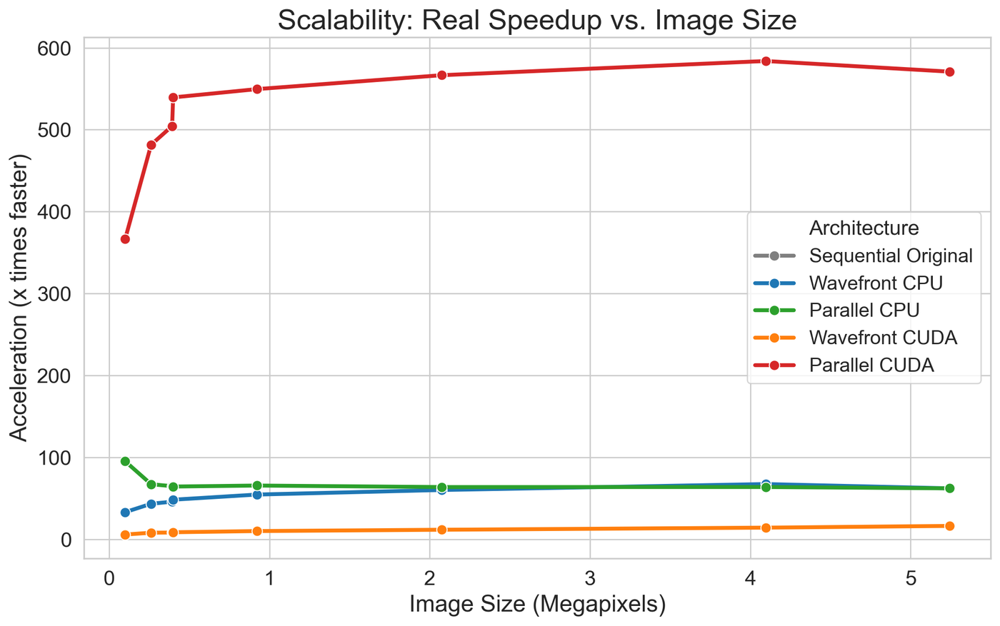
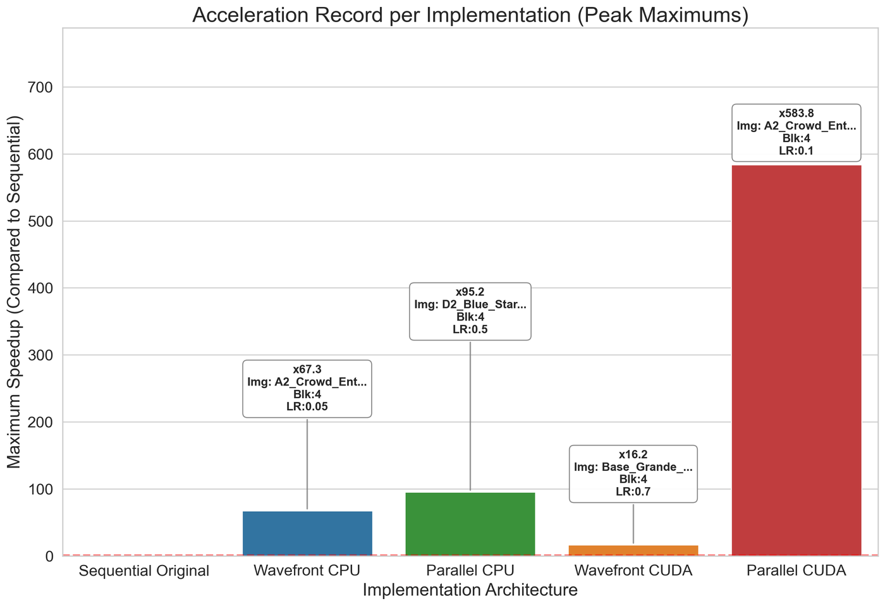
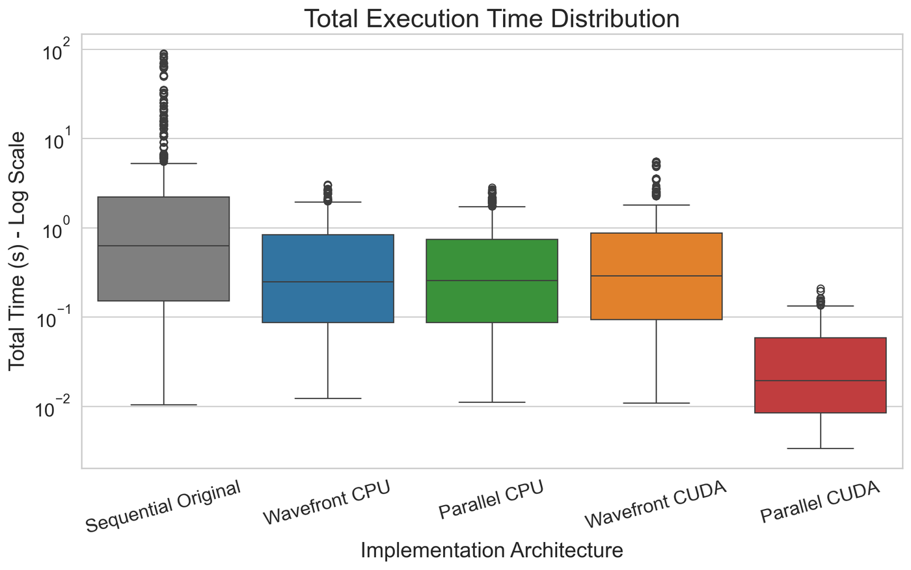
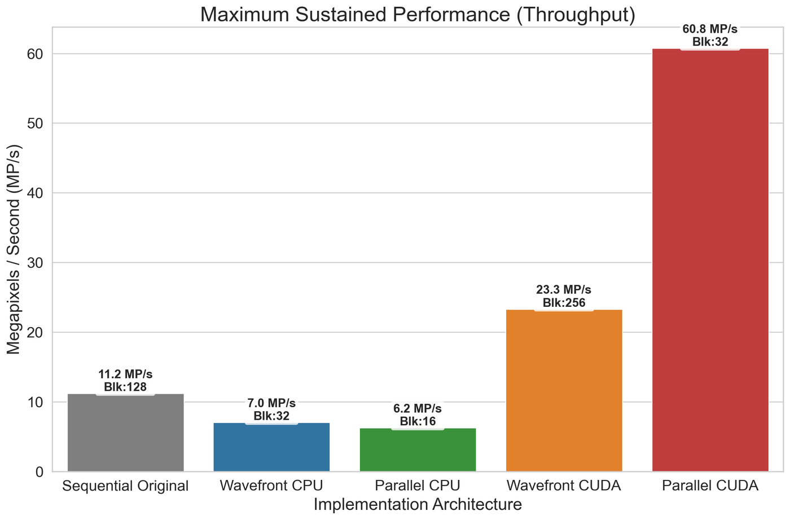
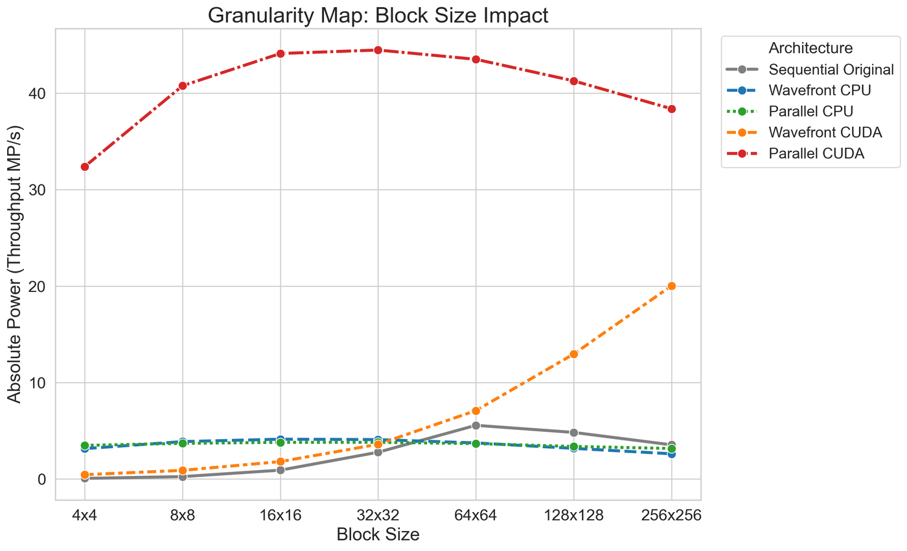
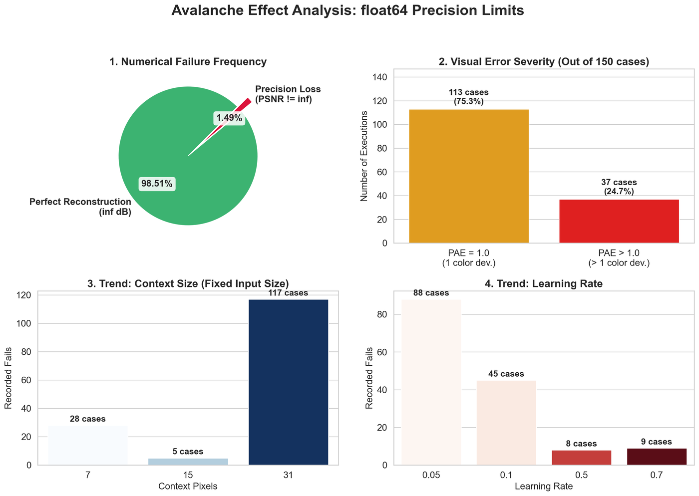
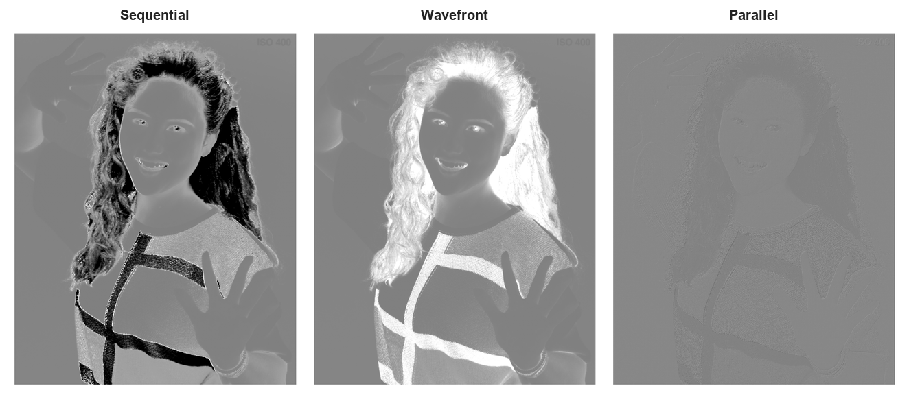

# R2-Net on CUDA

[](https://github.com/ablesarodriguez/r2net-cuda/actions/workflows/ci.yml)

**GPU acceleration of an AI-based lossless image compression technique.**

Bachelor's thesis (TFG) in Computer Engineering — Universitat Autònoma de Barcelona, 2025/26.
Author: Arnau Blesa Rodríguez · Supervisor: Joan Bartrina (dEIC, UAB)



The [Reversible Regression Network (R2-Net)](https://ieeexplore.ieee.org/document/10533747) predicts each image block with a tiny neural network that is overfitted on the fly, so no model parameters have to be transmitted. The catch is that every block needs its already-reconstructed neighbours as context, which forces a strictly sequential scan and leaves a GPU almost idle.

This project removes that bottleneck with two parallel traversal strategies, implemented on CPU (NumPy) and GPU (CUDA through CuPy), and measures what each one costs in speed, numerical precision and compressibility.

| | |
| --- | --- |
| Maximum speedup over the sequential baseline | **583.8×** (Parallel CUDA) |
| Peak throughput | **60.8 MP/s** (Parallel CUDA, 32×32 blocks) |
| Reconstruction in `float64` | lossless (PAE 0, MSE 0, PSNR ∞) |
| Reconstruction in `float32` | about 2× faster, PSNR 75.87 dB |

**Known limitation.** This work is about throughput, not compression ratio:
the residuals are floating-point values and their entropy (14–48 bpp) is
still above that of the original 8-bit image (about 7.7 bpp). Quantising the
residual is the main line of future work; see
[Speed has a compression cost](#speed-has-a-compression-cost).

📄 Full thesis (in Catalan, with an English abstract): [docs/thesis.pdf](docs/thesis.pdf)

## How it works

R2-Net is a single fully connected layer with a sigmoid activation. For every block it runs two back-propagation iterations starting from fixed weights, and stores only the residual. The decoder knows the same starting weights and the same context, so it can invert the process analytically and recover the block exactly.

The context of a block is the row of pixels above it and the column to its left, averaged down to a fixed-size input vector. Where that context comes from is what distinguishes the three approaches:



- **Sequential** — the original algorithm. Blocks are coded one by one in raster order.
- **Wavefront** — blocks on the same anti-diagonal do not depend on each other, so each diagonal is coded as one batch. The causal dependencies between blocks are kept.
- **Parallel** — each block takes its context from its own first row and column (stored with DPCM), so the whole image becomes a single batched matrix operation. It is the fastest option, but it gives up the correlation between neighbouring blocks.

On the GPU, both strategies use batched `cp.matmul`, buffers pre-allocated once in video memory, and a sigmoid kernel fused with `@cp.fuse`.

## Results

Benchmarks ran on an AMD Ryzen 5 5600X, 16 GB of RAM and an NVIDIA GeForce RTX 3060, with Python 3.12, CUDA Toolkit 12.4 and `cupy-cuda12x`. The test set has 18 images from 416×240 to 2560×2048, and every combination of block size {4 … 256}, learning rate {0.05, 0.1, 0.5, 0.7} and context size {7, 15, 20, 31} was measured. Each timing is the mean of five runs after a warm-up pass.

| Speedup vs. image size | Peak speedup per implementation |
| :---: | :---: |
|  |  |

| Execution time (log scale) | Maximum throughput |
| :---: | :---: |
|  |  |

| Throughput by block size | `float64` precision limits |
| :---: | :---: |
|  |  |

### Speed has a compression cost

Theoretical compressibility of the residual, in bits per pixel (lower is better). The original image is measured with zero-order Shannon entropy and the residuals with spatial conditional entropy over IEEE 754 bit planes.

| Image | Original | Sequential f64 | Sequential f32 | Wavefront f64 | Wavefront f32 | Parallel f64 | Parallel f32 |
| --- | ---: | ---: | ---: | ---: | ---: | ---: | ---: |
| A1 2560×1600 | 7.67 | 43.59 | 14.54 | 43.71 | 14.60 | 48.61 | 21.24 |
| B2 1920×1080 | 7.79 | 41.05 | 12.28 | 41.39 | 12.59 | 48.06 | 20.10 |
| C3 832×480 | 7.58 | 43.41 | 14.90 | 43.45 | 14.98 | 50.05 | 22.05 |



Wavefront keeps the compressibility of the sequential version, while Parallel produces a flatter map with a visible block grid: coding blocks in isolation breaks spatial correlation and makes the residual harder to compress. Floating-point residuals are also far from compact, which is why mantissa quantisation is the main line of future work (preliminary tests reach 6.03 bpp at 52.37 dB PSNR).

## Repository layout

```
├── src/
│   ├── coder_original.py         sequential baseline (CPU)
│   ├── coder_wavefront_cpu.py    Wavefront, NumPy
│   ├── coder_wavefront_cuda.py   Wavefront, CuPy / CUDA
│   ├── coder_parallel_cpu.py     Parallel, NumPy
│   ├── coder_parallel_cuda.py    Parallel, CuPy / CUDA
│   └── utils/                    RAW I/O, normalisation, padding, metrics
├── notebooks/
│   ├── R2Net.ipynb               end-to-end demo: load, compress, decompress, metrics
│   └── R2Net_Original.ipynb      reference R2-Net code on a single block
├── data/                         where the test images go (see data/README.md)
└── docs/
    ├── thesis.pdf                final thesis
    └── images/                   figures used in this README
```

## Getting started

```bash
pip install -r requirements.txt
```

The GPU coders also need an NVIDIA GPU with CUDA 12.x and CuPy:

```bash
pip install cupy-cuda12x
```

Download the test images from Zenodo into `data/` (see [data/README.md](data/README.md)), then open `notebooks/R2Net.ipynb` and pick the implementation with `MODE`:

| `MODE` | Implementation |
| :---: | --- |
| 1 | Sequential (CPU) |
| 2 | Wavefront (CPU) |
| 3 | Parallel (CPU) |
| 4 | Wavefront (CUDA) |
| 5 | Parallel (CUDA) |

The notebook imports all five coders, so CuPy has to be installed even for the CPU modes; remove the two `*_cuda` imports to run without a GPU.

### Using the coders from Python

```python
import sys
sys.path.append("src")

import numpy as np
from utils.io import load_raw_image
from utils.normalize import normalize_min_max_values, denormalize_min_max_values
from utils.metrics import calculate_metrics, print_metrics
from coder_wavefront_cpu import compress_wf_cpu, decompress_wf_cpu

raw = load_raw_image("data/n1_GRAY.ube8_1_2560_2048.raw", width=2048, height=2560, channels=1, encoding="ube8")
img = raw["array"]

lo, hi, norm = normalize_min_max_values(img, np.float64)

residual = compress_wf_cpu(norm, block_size=16, learning_rate=0.5, FIXED_INPUT_SIZE=16)
rec = decompress_wf_cpu(residual, block_size=16, learning_rate=0.5, FIXED_INPUT_SIZE=16, original_shape=img.shape)

rec = denormalize_min_max_values(rec, lo, hi)
print_metrics(calculate_metrics(img, rec, raw["params"]["bits"]))
```

All coders share this interface except `coder_parallel_cpu`, whose `compress_parallel_cpu` returns `(residual, context)` and whose `decompress_parallel_cpu` takes that `context` as its second argument. Because of this, `MODE = 3` needs those two calls adapted in the notebook.

## Data and references

- Test images: A. Blesa Rodríguez, *R2Net custom dataset*, Zenodo, 2026. [doi:10.5281/zenodo.20268850](https://zenodo.org/records/20268850)
- Benchmark data: A. Blesa Rodríguez, *R2Net Computational Benchmark and Hardware Performance Datasets (Float32 vs. Float64)*, Zenodo, 2026. [doi:10.5281/zenodo.20347920](https://zenodo.org/records/20347920)
- V. Sanchez, "Overfitted Neural Networks for Block-based Intra-prediction", *Data Compression Conference (DCC)*, 2024. [IEEE Xplore](https://ieeexplore.ieee.org/document/10533747)
- [CuPy](https://cupy.dev/) — NumPy-compatible array library accelerated by CUDA.

## Author and license

Arnau Blesa Rodríguez — Escola d'Enginyeria, Universitat Autònoma de Barcelona.

The code is released under the [MIT License](LICENSE).
